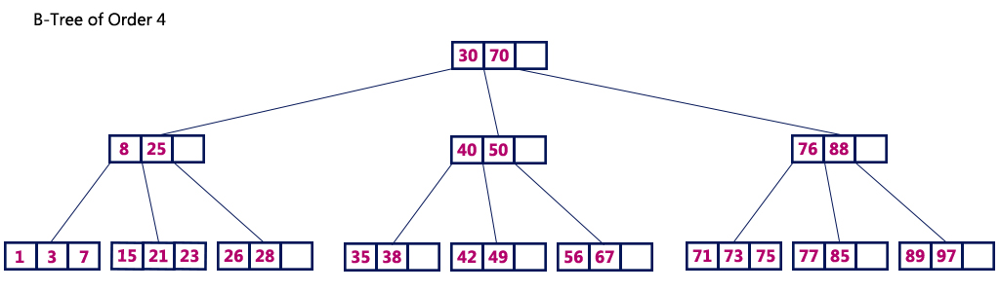

# B TREE 

## B-Tree Structure:
- Nodes contain keys and pointers.
- Internal nodes store keys and references to child nodes.
- Leaf nodes also contain keys and possibly associated values.

## Search:
- The search stops at the leaf or the node containing the key.
- Keys are distributed across all levels, including internal nodes.

## Insertion/Deletion:
- May require splitting or merging nodes to maintain balance.

## Usage:
- Useful for scenarios where frequent updates (insertions/deletions) are required.

## Traversal:
- Can be performed directly through internal and leaf nodes.
- Inefficient for range queries due to scattered key storage.

# B+ TREE 

## B+ Tree Structure:
- Similar to a B-Tree but with a different arrangement:
- Internal nodes contain keys but no values, only pointers to child nodes.
- Leaf nodes contain all keys and associated values in a sorted manner.
- Leaf nodes are linked, forming a linked list for sequential access.

## Search:
- The search always proceeds to the leaf level.
- Efficient for range queries due to the linked list structure of leaves.

## Insertion/Deletion:
- Similar to B-Trees, but the leaf node structure makes certain operations simpler.

## Usage:
- Preferred for applications requiring efficient range queries and sequential access, like databases and file systems.

## Traversal:
- More efficient for range queries and sorted order traversals due to the linked list of leaves.
