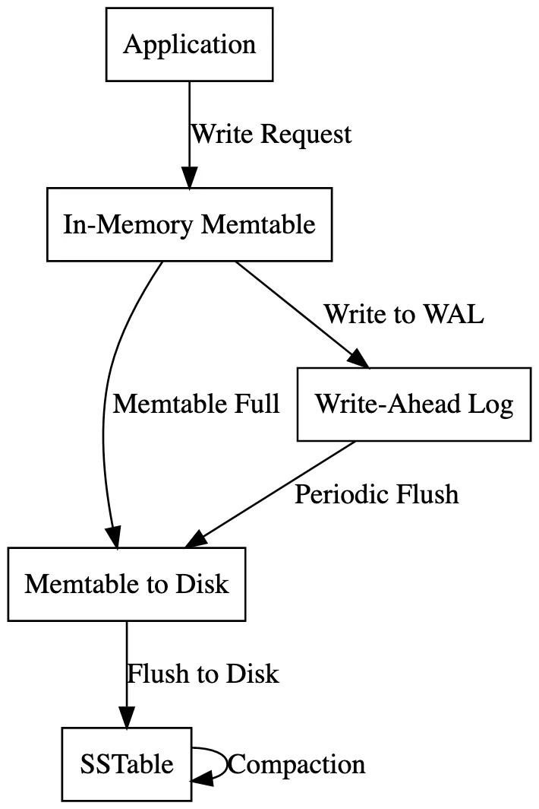

# Log-Structured Merge Tree

LSM tree, short for Log-Structured-Merge Tree, is a clever algorithm design that helps us store massive amounts of data without making us wait forever to write it. It stores data in memory first, which is lightning fast. But since we can’t keep everything in memory, the LSM Tree periodically flushes data to disk.

## Key Concepts of LSM Tree

### In-Memory Buffer:
- New data is written to an in-memory data structure (often a sorted structure like a Red-Black Tree or Skip List).
- This makes writes extremely fast compared to directly writing to disk.

### Write-Ahead Log (WAL):
- Every write is first appended to a WAL, ensuring durability.
- This ensures that if the system crashes, the changes can be replayed from the log.

### Flushing to Disk:
- Periodically, when the in-memory buffer reaches a size limit, the data is written (or "flushed") to disk as immutable Sorted String Tables (SSTables).

### Compaction:
- SSTables on disk are periodically merged and compacted to remove duplicates and reclaim space, maintaining an efficient query structure.

## How Writes Work in LSM Tree

### Initial Write to Memory:
- Data is first written to an in-memory data structure. This ensures low latency since memory access is much faster than disk I/O.

### Logging to WAL:
- Before the in-memory structure is updated, the write operation is recorded in a Write-Ahead Log (WAL) on disk.
- This guarantees data durability, allowing recovery in case of crashes.

### Flushing to SSTables:
- When the in-memory structure reaches a threshold, its contents are flushed to disk.
- The flushed data is organized as an SSTable, a sorted and immutable file format optimized for sequential access.

### Compaction and Merging:
- To manage multiple SSTables and avoid excessive lookups, compaction merges smaller SSTables into larger ones.
- This process removes redundant data, applies updates, and creates a more efficient disk layout.

## Advantages of LSM Tree

### Efficient Writes:
- Writing to memory and batching writes to disk minimizes random disk I/O operations.

### Durability:
- The WAL ensures that no data is lost during a crash.

### Space Optimization:
- Compaction reduces redundancy and optimizes disk usage.

### Sequential Disk Writes:
- Data flushing and compaction rely on sequential writes, which are faster than random writes.

## Illustrative Process

### Data Flow:
- Write Operation → Memory Buffer → Write-Ahead Log → SSTables.

### Maintenance:
- Flushing (from memory to SSTables) and Compaction (merging disk files) maintain system efficiency.

LSM Trees are a core feature in modern databases like Cassandra, RocksDB, and LevelDB, making them ideal for write-intensive applications such as distributed systems and analytics platforms.

## Optimisations: